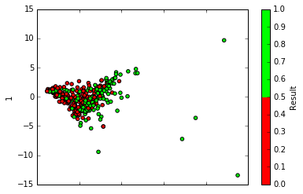
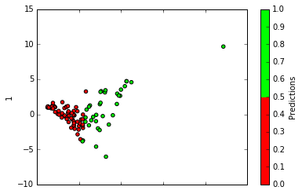
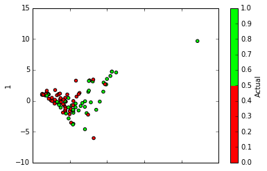

# Predicting NaNoWriMo winners with Logistic Regression

As the variable I want to predict is binary (1 if a writer is a winner, 0 if otherwise) I decided to use a logistic regression as my prediction model.  


```python
# import the data
import pandas as pd
import numpy as np
import warnings
warnings.filterwarnings('ignore')

writers = pd.read_csv("../clean data/user_summary_no2015.csv", index_col=0)
writers.head()
```


<div>
<table border="1" class="dataframe">
  <thead>
    <tr style="text-align: right;">
      <th></th>
      <th>Writer Name</th>
      <th>Member Length</th>
      <th>LifetimeWordCount</th>
      <th>url</th>
      <th>Age</th>
      <th>Birthday</th>
      <th>Favorite books or authors</th>
      <th>Favorite noveling music</th>
      <th>Hobbies</th>
      <th>Location</th>
      <th>...</th>
      <th>Expected Max Submission</th>
      <th>Expected Max Day</th>
      <th>Expected Std Submissions</th>
      <th>Expected Consec Subs</th>
      <th>FW Total</th>
      <th>FW Sub</th>
      <th>FH Total</th>
      <th>FH Sub</th>
      <th>SH Total</th>
      <th>SH Sub</th>
    </tr>
  </thead>
  <tbody>
    <tr>
      <th>0</th>
      <td>Nicaless</td>
      <td>2</td>
      <td>50919</td>
      <td>http://nanowrimo.org/participants/nicaless</td>
      <td>24</td>
      <td>December 20</td>
      <td>Ursula Le Guin, J.K.</td>
      <td>Classical, Musicals</td>
      <td>Reading, Video Games, Blogging, Learning</td>
      <td>San Francisco, CA</td>
      <td>...</td>
      <td>24935.0</td>
      <td>28.000000</td>
      <td>6235.712933</td>
      <td>12.000000</td>
      <td>6689</td>
      <td>6</td>
      <td>12486</td>
      <td>9</td>
      <td>11743</td>
      <td>3</td>
    </tr>
    <tr>
      <th>1</th>
      <td>Rachel B. Moore</td>
      <td>10</td>
      <td>478090</td>
      <td>http://nanowrimo.org/participants/rachel-b-moore</td>
      <td>NaN</td>
      <td>NaN</td>
      <td>2666, Unaccustomed Earth, Exit Music, Crazy Lo...</td>
      <td>Belle and Sebastian, Elliott Smith, PJ Harvey,...</td>
      <td>Reading, volunteering, knitting, listening to ...</td>
      <td>San Francisco</td>
      <td>...</td>
      <td>3809.0</td>
      <td>9.000000</td>
      <td>1002.295167</td>
      <td>6.800000</td>
      <td>16722</td>
      <td>7</td>
      <td>24086</td>
      <td>14</td>
      <td>26517</td>
      <td>14</td>
    </tr>
    <tr>
      <th>2</th>
      <td>abookishbabe</td>
      <td>1</td>
      <td>0</td>
      <td>http://nanowrimo.org/participants/abookishbabe</td>
      <td>NaN</td>
      <td>April 2</td>
      <td>Colleen Hoover, Veronica Roth, Jennifer Niven,...</td>
      <td>Tori Kelley</td>
      <td>Reading (DUH), Day dreaming, Going to Disneyla...</td>
      <td>Sacramento, CA</td>
      <td>...</td>
      <td>NaN</td>
      <td>NaN</td>
      <td>NaN</td>
      <td>NaN</td>
      <td>28632</td>
      <td>1</td>
      <td>29299</td>
      <td>2</td>
      <td>0</td>
      <td>0</td>
    </tr>
    <tr>
      <th>3</th>
      <td>alexabexis</td>
      <td>11</td>
      <td>475500</td>
      <td>http://nanowrimo.org/participants/alexabexis</td>
      <td>NaN</td>
      <td>NaN</td>
      <td>NaN</td>
      <td>Three Goddesses playlist Florence + the Machin...</td>
      <td>drawing, reading, movies &amp; TV shows, comics, p...</td>
      <td>New York City</td>
      <td>...</td>
      <td>2325.0</td>
      <td>8.545455</td>
      <td>570.626795</td>
      <td>8.090909</td>
      <td>25360</td>
      <td>7</td>
      <td>38034</td>
      <td>12</td>
      <td>40766</td>
      <td>9</td>
    </tr>
    <tr>
      <th>4</th>
      <td>AllYellowFlowers</td>
      <td>3</td>
      <td>30428</td>
      <td>http://nanowrimo.org/participants/AllYellowFlo...</td>
      <td>NaN</td>
      <td>NaN</td>
      <td>Lolita, Jesus' Son, Ask the</td>
      <td>the sound of the coffeemaker</td>
      <td>cryptozoology</td>
      <td>Allston</td>
      <td>...</td>
      <td>2054.5</td>
      <td>4.500000</td>
      <td>538.273315</td>
      <td>21.000000</td>
      <td>1800</td>
      <td>5</td>
      <td>5300</td>
      <td>10</td>
      <td>5700</td>
      <td>9</td>
    </tr>
  </tbody>
</table>
<p>5 rows × 41 columns</p>
</div>


```python
writers.columns
```


    Index([u'Writer Name', u'Member Length', u'LifetimeWordCount', u'url', u'Age',
           u'Birthday', u'Favorite books or authors', u'Favorite noveling music',
           u'Hobbies', u'Location', u'Occupation', u'Primary Role',
           u'Sponsorship URL', u'Expected Final Word Count',
           u'Expected Daily Average', u'CURRENT WINNER', u'Current Donor', u'Wins',
           u'Donations', u'Participated', u'Consecutive Donor',
           u'Consecutive Wins', u'Consecutive Part', u'Part Years', u'Win Years',
           u'Donor Years', u'Num Novels', u'Expected Num Submissions',
           u'Expected Avg Submission', u'Expected Min Submission',
           u'Expected Min Day', u'Expected Max Submission', u'Expected Max Day',
           u'Expected Std Submissions', u'Expected Consec Subs', u'FW Total',
           u'FW Sub', u'FH Total', u'FH Sub', u'SH Total', u'SH Sub'],
          dtype='object')


```python
# convert primary role and sponsorship url to binary vars
writers['Primary Role'][writers['Primary Role'] == 'Municipal Liaison'] = 1
writers['Primary Role'][writers['Primary Role'] != 1] = 0

writers['Sponsorship URL'].fillna(0, inplace=True)
writers['Sponsorship URL'][writers['Sponsorship URL'] != 0] = 1
```


```python
# let's keep ALL NUMERIAL COLUMNS except the CURRENT WINNER column which we will use as response
features = writers._get_numeric_data()
```


```python
del features['CURRENT WINNER']
#deleting features 
del features['SH Sub']
del features['SH Total']
features.head()
```


<div>
<table border="1" class="dataframe">
  <thead>
    <tr style="text-align: right;">
      <th></th>
      <th>Member Length</th>
      <th>LifetimeWordCount</th>
      <th>Age</th>
      <th>Expected Final Word Count</th>
      <th>Expected Daily Average</th>
      <th>Current Donor</th>
      <th>Wins</th>
      <th>Donations</th>
      <th>Participated</th>
      <th>Consecutive Donor</th>
      <th>...</th>
      <th>Expected Min Submission</th>
      <th>Expected Min Day</th>
      <th>Expected Max Submission</th>
      <th>Expected Max Day</th>
      <th>Expected Std Submissions</th>
      <th>Expected Consec Subs</th>
      <th>FW Total</th>
      <th>FW Sub</th>
      <th>FH Total</th>
      <th>FH Sub</th>
    </tr>
  </thead>
  <tbody>
    <tr>
      <th>0</th>
      <td>2</td>
      <td>50919</td>
      <td>24</td>
      <td>50919.000000</td>
      <td>1697.300000</td>
      <td>0</td>
      <td>1</td>
      <td>1</td>
      <td>1</td>
      <td>1</td>
      <td>...</td>
      <td>299.0</td>
      <td>2.000000</td>
      <td>24935.0</td>
      <td>28.000000</td>
      <td>6235.712933</td>
      <td>12.000000</td>
      <td>6689</td>
      <td>6</td>
      <td>12486</td>
      <td>9</td>
    </tr>
    <tr>
      <th>1</th>
      <td>10</td>
      <td>478090</td>
      <td>NaN</td>
      <td>47809.000000</td>
      <td>1593.633333</td>
      <td>1</td>
      <td>8</td>
      <td>8</td>
      <td>10</td>
      <td>8</td>
      <td>...</td>
      <td>42.7</td>
      <td>7.700000</td>
      <td>3809.0</td>
      <td>9.000000</td>
      <td>1002.295167</td>
      <td>6.800000</td>
      <td>16722</td>
      <td>7</td>
      <td>24086</td>
      <td>14</td>
    </tr>
    <tr>
      <th>2</th>
      <td>1</td>
      <td>0</td>
      <td>NaN</td>
      <td>NaN</td>
      <td>NaN</td>
      <td>1</td>
      <td>0</td>
      <td>0</td>
      <td>0</td>
      <td>0</td>
      <td>...</td>
      <td>NaN</td>
      <td>NaN</td>
      <td>NaN</td>
      <td>NaN</td>
      <td>NaN</td>
      <td>NaN</td>
      <td>28632</td>
      <td>1</td>
      <td>29299</td>
      <td>2</td>
    </tr>
    <tr>
      <th>3</th>
      <td>11</td>
      <td>475500</td>
      <td>NaN</td>
      <td>43227.272727</td>
      <td>1440.909091</td>
      <td>1</td>
      <td>7</td>
      <td>7</td>
      <td>11</td>
      <td>4</td>
      <td>...</td>
      <td>36.0</td>
      <td>6.727273</td>
      <td>2325.0</td>
      <td>8.545455</td>
      <td>570.626795</td>
      <td>8.090909</td>
      <td>25360</td>
      <td>7</td>
      <td>38034</td>
      <td>12</td>
    </tr>
    <tr>
      <th>4</th>
      <td>3</td>
      <td>30428</td>
      <td>NaN</td>
      <td>15214.000000</td>
      <td>507.133333</td>
      <td>0</td>
      <td>0</td>
      <td>0</td>
      <td>2</td>
      <td>0</td>
      <td>...</td>
      <td>50.0</td>
      <td>10.500000</td>
      <td>2054.5</td>
      <td>4.500000</td>
      <td>538.273315</td>
      <td>21.000000</td>
      <td>1800</td>
      <td>5</td>
      <td>5300</td>
      <td>10</td>
    </tr>
  </tbody>
</table>
<p>5 rows × 25 columns</p>
</div>


```python
y = writers['CURRENT WINNER'].values
```


```python
# inputting 0 for users without prior data for daily avg, avg submission, num submissions etc. and so are marked NaN
features.fillna(0, inplace=True)
features.describe()
```


<div>
<table border="1" class="dataframe">
  <thead>
    <tr style="text-align: right;">
      <th></th>
      <th>Member Length</th>
      <th>LifetimeWordCount</th>
      <th>Age</th>
      <th>Expected Final Word Count</th>
      <th>Expected Daily Average</th>
      <th>Current Donor</th>
      <th>Wins</th>
      <th>Donations</th>
      <th>Participated</th>
      <th>Consecutive Donor</th>
      <th>...</th>
      <th>Expected Min Submission</th>
      <th>Expected Min Day</th>
      <th>Expected Max Submission</th>
      <th>Expected Max Day</th>
      <th>Expected Std Submissions</th>
      <th>Expected Consec Subs</th>
      <th>FW Total</th>
      <th>FW Sub</th>
      <th>FH Total</th>
      <th>FH Sub</th>
    </tr>
  </thead>
  <tbody>
    <tr>
      <th>count</th>
      <td>501.000000</td>
      <td>501.000000</td>
      <td>501.000000</td>
      <td>501.000000</td>
      <td>501.000000</td>
      <td>501.000000</td>
      <td>501.000000</td>
      <td>501.000000</td>
      <td>501.000000</td>
      <td>501.000000</td>
      <td>...</td>
      <td>501.000000</td>
      <td>501.000000</td>
      <td>501.000000</td>
      <td>501.000000</td>
      <td>501.000000</td>
      <td>501.000000</td>
      <td>501.000000</td>
      <td>501.000000</td>
      <td>501.000000</td>
      <td>501.000000</td>
    </tr>
    <tr>
      <th>mean</th>
      <td>4.212575</td>
      <td>172552.676647</td>
      <td>8.596806</td>
      <td>36428.312194</td>
      <td>1214.277073</td>
      <td>0.317365</td>
      <td>2.606786</td>
      <td>1.421158</td>
      <td>3.656687</td>
      <td>1.047904</td>
      <td>...</td>
      <td>73.105821</td>
      <td>6.128300</td>
      <td>4764.389341</td>
      <td>10.005534</td>
      <td>1314.411102</td>
      <td>9.573348</td>
      <td>12203.137725</td>
      <td>4.413174</td>
      <td>20962.403194</td>
      <td>8.137725</td>
    </tr>
    <tr>
      <th>std</th>
      <td>3.255209</td>
      <td>329113.331830</td>
      <td>14.463648</td>
      <td>43782.218313</td>
      <td>1459.407277</td>
      <td>0.465916</td>
      <td>4.651782</td>
      <td>3.044384</td>
      <td>4.899582</td>
      <td>1.760029</td>
      <td>...</td>
      <td>1566.761571</td>
      <td>6.145692</td>
      <td>5727.358954</td>
      <td>8.406292</td>
      <td>2011.241171</td>
      <td>8.393503</td>
      <td>39000.987493</td>
      <td>2.614373</td>
      <td>54462.877403</td>
      <td>5.140330</td>
    </tr>
    <tr>
      <th>min</th>
      <td>0.166667</td>
      <td>0.000000</td>
      <td>0.000000</td>
      <td>0.000000</td>
      <td>0.000000</td>
      <td>0.000000</td>
      <td>0.000000</td>
      <td>0.000000</td>
      <td>0.000000</td>
      <td>0.000000</td>
      <td>...</td>
      <td>-21113.500000</td>
      <td>0.000000</td>
      <td>0.000000</td>
      <td>0.000000</td>
      <td>0.000000</td>
      <td>0.000000</td>
      <td>0.000000</td>
      <td>0.000000</td>
      <td>0.000000</td>
      <td>0.000000</td>
    </tr>
    <tr>
      <th>25%</th>
      <td>1.000000</td>
      <td>9818.000000</td>
      <td>0.000000</td>
      <td>7443.250000</td>
      <td>248.108333</td>
      <td>0.000000</td>
      <td>0.000000</td>
      <td>0.000000</td>
      <td>1.000000</td>
      <td>0.000000</td>
      <td>...</td>
      <td>0.000000</td>
      <td>1.000000</td>
      <td>955.000000</td>
      <td>1.000000</td>
      <td>256.685927</td>
      <td>0.000000</td>
      <td>2258.000000</td>
      <td>2.000000</td>
      <td>3925.000000</td>
      <td>3.000000</td>
    </tr>
    <tr>
      <th>50%</th>
      <td>4.000000</td>
      <td>93385.000000</td>
      <td>0.000000</td>
      <td>37594.333333</td>
      <td>1253.144444</td>
      <td>0.000000</td>
      <td>1.000000</td>
      <td>0.000000</td>
      <td>2.000000</td>
      <td>0.000000</td>
      <td>...</td>
      <td>85.666667</td>
      <td>4.500000</td>
      <td>3546.500000</td>
      <td>9.333333</td>
      <td>873.018486</td>
      <td>8.500000</td>
      <td>7890.000000</td>
      <td>5.000000</td>
      <td>15212.000000</td>
      <td>10.000000</td>
    </tr>
    <tr>
      <th>75%</th>
      <td>6.000000</td>
      <td>206482.000000</td>
      <td>20.000000</td>
      <td>50734.200000</td>
      <td>1691.140000</td>
      <td>1.000000</td>
      <td>3.000000</td>
      <td>2.000000</td>
      <td>5.000000</td>
      <td>1.000000</td>
      <td>...</td>
      <td>291.500000</td>
      <td>10.000000</td>
      <td>6250.000000</td>
      <td>16.200000</td>
      <td>1516.145753</td>
      <td>16.000000</td>
      <td>12361.000000</td>
      <td>7.000000</td>
      <td>23832.000000</td>
      <td>13.000000</td>
    </tr>
    <tr>
      <th>max</th>
      <td>13.000000</td>
      <td>4562712.000000</td>
      <td>61.000000</td>
      <td>651816.000000</td>
      <td>21727.200000</td>
      <td>1.000000</td>
      <td>52.000000</td>
      <td>36.000000</td>
      <td>52.000000</td>
      <td>9.000000</td>
      <td>...</td>
      <td>5000.000000</td>
      <td>27.666667</td>
      <td>51238.000000</td>
      <td>30.000000</td>
      <td>23874.872328</td>
      <td>30.000000</td>
      <td>630036.000000</td>
      <td>7.000000</td>
      <td>1000000.000000</td>
      <td>14.000000</td>
    </tr>
  </tbody>
</table>
<p>8 rows × 25 columns</p>
</div>


```python
from sklearn.linear_model import LogisticRegression
from sklearn.preprocessing import StandardScaler
from sklearn.cross_validation import cross_val_score
from sklearn.cross_validation import train_test_split
from sklearn.metrics import classification_report
from sklearn.metrics import confusion_matrix
from sklearn.metrics import roc_curve
from sklearn.metrics import auc
from bokeh.plotting import figure,show,output_notebook
from bokeh.models import Range1d
output_notebook()
```


    <script type="text/javascript">
      
      (function(global) {
        function now() {
          return new Date();
        }
      
        if (typeof (window._bokeh_onload_callbacks) === "undefined") {
          window._bokeh_onload_callbacks = [];
        }
      
        function run_callbacks() {
          window._bokeh_onload_callbacks.forEach(function(callback) { callback() });
          delete window._bokeh_onload_callbacks
          console.info("Bokeh: all callbacks have finished");
        }
      
        function load_libs(js_urls, callback) {
          window._bokeh_onload_callbacks.push(callback);
          if (window._bokeh_is_loading > 0) {
            console.log("Bokeh: BokehJS is being loaded, scheduling callback at", now());
            return null;
          }
          if (js_urls == null || js_urls.length === 0) {
            run_callbacks();
            return null;
          }
          console.log("Bokeh: BokehJS not loaded, scheduling load and callback at", now());
          window._bokeh_is_loading = js_urls.length;
          for (var i = 0; i < js_urls.length; i++) {
            var url = js_urls[i];
            var s = document.createElement('script');
            s.src = url;
            s.async = false;
            s.onreadystatechange = s.onload = function() {
              window._bokeh_is_loading--;
              if (window._bokeh_is_loading === 0) {
                console.log("Bokeh: all BokehJS libraries loaded");
                run_callbacks()
              }
            };
            s.onerror = function() {
              console.warn("failed to load library " + url);
            };
            console.log("Bokeh: injecting script tag for BokehJS library: ", url);
            document.getElementsByTagName("head")[0].appendChild(s);
          }
        };var js_urls = ['https://cdn.pydata.org/bokeh/release/bokeh-0.11.0.min.js', 'https://cdn.pydata.org/bokeh/release/bokeh-widgets-0.11.0.min.js', 'https://cdn.pydata.org/bokeh/release/bokeh-compiler-0.11.0.min.js'];
      
        var inline_js = [
          function(Bokeh) {
            Bokeh.set_log_level("info");
          },
          function(Bokeh) {
            console.log("Bokeh: injecting CSS: https://cdn.pydata.org/bokeh/release/bokeh-0.11.0.min.css");
            Bokeh.embed.inject_css("https://cdn.pydata.org/bokeh/release/bokeh-0.11.0.min.css");
            console.log("Bokeh: injecting CSS: https://cdn.pydata.org/bokeh/release/bokeh-widgets-0.11.0.min.css");
            Bokeh.embed.inject_css("https://cdn.pydata.org/bokeh/release/bokeh-widgets-0.11.0.min.css");
          }
        ];
      
        function run_inline_js() {
          for (var i = 0; i < inline_js.length; i++) {
            inline_js[i](window.Bokeh);
          }
        }
      
        if (window._bokeh_is_loading === 0) {
          console.log("Bokeh: BokehJS loaded, going straight to plotting");
          run_inline_js();
        } else {
          load_libs(js_urls, function() {
            console.log("Bokeh: BokehJS plotting callback run at", now());
            run_inline_js();
          });
        }
      }(this));
    </script>
    <div>
        <a href="http://bokeh.pydata.org" target="_blank" class="bk-logo bk-logo-small bk-logo-notebook"></a>
        <span>BokehJS successfully loaded.</span>
    </div>


### Normalize data


```python
scaler = StandardScaler()
features_norm = scaler.fit_transform(features)
features_norm[1]
```


    array([ 1.77967343,  0.92929298, -0.5949674 ,  0.26019839,  0.26019839,
            1.46660949,  1.16054543,  2.1631367 ,  1.29595831,  3.95393831,
            1.98638802,  2.35830378,  1.92083955, -0.29678396, -0.38505565,
           -0.01942619,  0.25599572, -0.16697823, -0.11973645, -0.15534084,
           -0.33074635,  0.11598114,  0.99045236,  0.05741009,  1.14158714])


### Apply Logistic Regression


```python
def plot_roc_curve(target_test, target_predicted_proba):
    fpr, tpr, thresholds = roc_curve(target_test, target_predicted_proba[:, 1])
    
    roc_auc = auc(fpr, tpr)
    
    p = figure(title='Receiver Operating Characteristic')
    # Plot ROC curve
    p.line(x=fpr,y=tpr,legend='ROC curve (area = %0.3f)' % roc_auc)
    p.x_range=Range1d(0,1)
    p.y_range=Range1d(0,1)
    p.xaxis.axis_label='False Positive Rate or (1 - Specifity)'
    p.yaxis.axis_label='True Positive Rate or (Sensitivity)'
    p.legend.orientation = "bottom_right"
    show(p)
    
%matplotlib inline
```


```python
X_train, X_test, y_train, y_test = train_test_split(features_norm,y, test_size=0.2, random_state=0)
```


```python
model_lr = LogisticRegression(C=5)
cross_val_score(model_lr,X_train, y_train,cv=10).mean()
```


    0.8623889931207005


Wow! That's a very good cross validation score! Now let's check out the model's confusion matrix and classification report and how well it does predicting the targets of the test data.


```python
model_lr.fit(X_train,y_train)
print pd.DataFrame(confusion_matrix(y_test,model_lr.predict(X_test)), index=['Predicted Class 0', 'Predicted Class 1'], 
                     columns=['Actual Class 0', 'Actual Class 1'])
print classification_report(y_test,model_lr.predict(X_test))
print model_lr.score(X_test,y_test)
plot_roc_curve(y_test, model_lr.predict_proba(X_test))
```

                       Actual Class 0  Actual Class 1
    Predicted Class 0              46               9
    Predicted Class 1               8              38
                 precision    recall  f1-score   support
    
              0       0.85      0.84      0.84        55
              1       0.81      0.83      0.82        46
    
    avg / total       0.83      0.83      0.83       101
    
    0.831683168317


    <div class="plotdiv" id="c34152ae-b7a7-4021-a905-1162df03e699"></div>
<script type="text/javascript">
  
  (function(global) {
    function now() {
      return new Date();
    }
  
    if (typeof (window._bokeh_onload_callbacks) === "undefined") {
      window._bokeh_onload_callbacks = [];
    }
  
    function run_callbacks() {
      window._bokeh_onload_callbacks.forEach(function(callback) { callback() });
      delete window._bokeh_onload_callbacks
      console.info("Bokeh: all callbacks have finished");
    }
  
    function load_libs(js_urls, callback) {
      window._bokeh_onload_callbacks.push(callback);
      if (window._bokeh_is_loading > 0) {
        console.log("Bokeh: BokehJS is being loaded, scheduling callback at", now());
        return null;
      }
      if (js_urls == null || js_urls.length === 0) {
        run_callbacks();
        return null;
      }
      console.log("Bokeh: BokehJS not loaded, scheduling load and callback at", now());
      window._bokeh_is_loading = js_urls.length;
      for (var i = 0; i < js_urls.length; i++) {
        var url = js_urls[i];
        var s = document.createElement('script');
        s.src = url;
        s.async = false;
        s.onreadystatechange = s.onload = function() {
          window._bokeh_is_loading--;
          if (window._bokeh_is_loading === 0) {
            console.log("Bokeh: all BokehJS libraries loaded");
            run_callbacks()
          }
        };
        s.onerror = function() {
          console.warn("failed to load library " + url);
        };
        console.log("Bokeh: injecting script tag for BokehJS library: ", url);
        document.getElementsByTagName("head")[0].appendChild(s);
      }
    };var element = document.getElementById("c34152ae-b7a7-4021-a905-1162df03e699");
    if (element == null) {
      console.log("Bokeh: ERROR: autoload.js configured with elementid 'c34152ae-b7a7-4021-a905-1162df03e699' but no matching script tag was found. ")
      return false;
    }var js_urls = [];
  
    var inline_js = [
      function(Bokeh) {
        Bokeh.$(function() {
            var docs_json = {"00435098-3aa6-41d2-985c-3f69c4e69985": {"version": "0.11.0", "roots": {"root_ids": ["a21b58ac-9738-45a8-9c81-9d0527e32a86", "dc1f8d7d-2069-4df0-8089-4f31d8cc0caf", "46f1ca09-f3b9-494a-be85-ade83b20cbc6"], "references": [{"attributes": {"plot": {"subtype": "Figure", "type": "Plot", "id": "dc1f8d7d-2069-4df0-8089-4f31d8cc0caf"}, "overlay": {"type": "BoxAnnotation", "id": "1bc23a55-1e33-49db-bdcd-05805c7a4664"}}, "type": "BoxZoomTool", "id": "753f080d-90a9-4cae-9e0a-7d0c67166a81"}, {"attributes": {"nonselection_glyph": {"type": "Line", "id": "e5750240-4804-415b-b053-b51a8d6fd9ff"}, "data_source": {"type": "ColumnDataSource", "id": "e5998992-e7fd-494a-98f8-7c56652217de"}, "selection_glyph": null, "hover_glyph": null, "glyph": {"type": "Line", "id": "2a1295b6-8c18-4d98-b2f9-59fe075ea4df"}}, "type": "GlyphRenderer", "id": "2c55d054-a551-49d1-93b6-b4e69a2a9396"}, {"attributes": {"line_color": {"value": "#1f77b4"}, "line_alpha": {"value": 0.1}, "y": {"field": "y"}, "x": {"field": "x"}}, "type": "Line", "id": "e5750240-4804-415b-b053-b51a8d6fd9ff"}, {"attributes": {"callback": null, "column_names": ["y", "x"], "data": {"y": [0.0, 0.06521739130434782, 0.2608695652173913, 0.30434782608695654, 0.5434782608695652, 0.5434782608695652, 0.5869565217391305, 0.5869565217391305, 0.9130434782608695, 0.9130434782608695, 1.0, 1.0], "x": [0.0, 0.01818181818181818, 0.01818181818181818, 0.01818181818181818, 0.01818181818181818, 0.03636363636363636, 0.03636363636363636, 0.05454545454545454, 0.05454545454545454, 0.07272727272727272, 0.07272727272727272, 1.0]}}, "type": "ColumnDataSource", "id": "e5998992-e7fd-494a-98f8-7c56652217de"}, {"attributes": {"plot": {"subtype": "Figure", "type": "Plot", "id": "dc1f8d7d-2069-4df0-8089-4f31d8cc0caf"}}, "type": "ResizeTool", "id": "1f3e89a7-b50b-4cd6-ab8e-dd2a6197c6bf"}, {"attributes": {"line_color": {"value": "#1f77b4"}, "line_alpha": {"value": 0.1}, "y": {"field": "y"}, "x": {"field": "x"}}, "type": "Line", "id": "da9ab4a2-8479-4595-9369-8a8c354edc11"}, {"attributes": {"callback": null, "column_names": ["y", "x"], "data": {"y": [0.0, 0.0, 0.41304347826086957, 0.41304347826086957, 0.4782608695652174, 0.4782608695652174, 0.5217391304347826, 0.5217391304347826, 0.717391304347826, 0.717391304347826, 0.7391304347826086, 0.7391304347826086, 0.7608695652173914, 0.7608695652173914, 0.8695652173913043, 0.8695652173913043, 0.9130434782608695, 0.9130434782608695, 0.9347826086956522, 0.9347826086956522, 0.9565217391304348, 0.9565217391304348, 1.0, 1.0], "x": [0.0, 0.01818181818181818, 0.01818181818181818, 0.03636363636363636, 0.03636363636363636, 0.05454545454545454, 0.05454545454545454, 0.07272727272727272, 0.07272727272727272, 0.10909090909090909, 0.10909090909090909, 0.14545454545454545, 0.14545454545454545, 0.16363636363636364, 0.16363636363636364, 0.21818181818181817, 0.21818181818181817, 0.23636363636363636, 0.23636363636363636, 0.41818181818181815, 0.41818181818181815, 0.7818181818181819, 0.7818181818181819, 1.0]}}, "type": "ColumnDataSource", "id": "d3922c91-42ed-4745-abb3-f454f67b0d08"}, {"attributes": {}, "type": "BasicTicker", "id": "dbfa6462-5dce-45d9-9050-66512cfd506e"}, {"attributes": {"plot": {"subtype": "Figure", "type": "Plot", "id": "46f1ca09-f3b9-494a-be85-ade83b20cbc6"}, "axis_label": "False Positive Rate or (1 - Specifity)", "formatter": {"type": "BasicTickFormatter", "id": "8482c2c2-2ef6-415e-8a73-651cf17088f5"}, "ticker": {"type": "BasicTicker", "id": "d5966f2d-a1ee-44da-b284-7c523e27388e"}}, "type": "LinearAxis", "id": "8ad7b553-2451-45f5-8e9d-18af2dd9c0c0"}, {"attributes": {}, "type": "BasicTickFormatter", "id": "d37c18cc-310d-4b82-a4c2-7b74ce96fa89"}, {"attributes": {"plot": {"subtype": "Figure", "type": "Plot", "id": "dc1f8d7d-2069-4df0-8089-4f31d8cc0caf"}}, "type": "PanTool", "id": "cf28b0d0-c298-498a-bb4a-fb708fb00129"}, {"attributes": {"callback": null}, "type": "Range1d", "id": "e4db7c17-4c89-4994-baaf-b1aa3cfb0ebf"}, {"attributes": {"plot": {"subtype": "Figure", "type": "Plot", "id": "dc1f8d7d-2069-4df0-8089-4f31d8cc0caf"}, "legends": [["ROC curve (area = 0.965)", [{"type": "GlyphRenderer", "id": "2c55d054-a551-49d1-93b6-b4e69a2a9396"}]]], "location": "bottom_right"}, "type": "Legend", "id": "421ebcc7-9134-419c-8c0a-dfe144fafb51"}, {"attributes": {"plot": {"subtype": "Figure", "type": "Plot", "id": "46f1ca09-f3b9-494a-be85-ade83b20cbc6"}}, "type": "PanTool", "id": "d21f5832-6b7d-4408-bf51-4b069a6096fb"}, {"attributes": {"plot": {"subtype": "Figure", "type": "Plot", "id": "a21b58ac-9738-45a8-9c81-9d0527e32a86"}}, "type": "HelpTool", "id": "baa36e3d-3fd9-43c1-91e0-023f1b104397"}, {"attributes": {"plot": {"subtype": "Figure", "type": "Plot", "id": "a21b58ac-9738-45a8-9c81-9d0527e32a86"}, "axis_label": "True Positive Rate or (Sensitivity)", "formatter": {"type": "BasicTickFormatter", "id": "4aa5698f-ec62-4c70-ae45-4e08c36b013b"}, "ticker": {"type": "BasicTicker", "id": "dbfa6462-5dce-45d9-9050-66512cfd506e"}}, "type": "LinearAxis", "id": "a65c4e49-c353-40e6-9d13-9184f1abbbaf"}, {"attributes": {"plot": {"subtype": "Figure", "type": "Plot", "id": "46f1ca09-f3b9-494a-be85-ade83b20cbc6"}, "ticker": {"type": "BasicTicker", "id": "d5966f2d-a1ee-44da-b284-7c523e27388e"}}, "type": "Grid", "id": "6bb04fe9-32d7-4e9a-8579-b76a34061f87"}, {"attributes": {"plot": {"subtype": "Figure", "type": "Plot", "id": "a21b58ac-9738-45a8-9c81-9d0527e32a86"}, "ticker": {"type": "BasicTicker", "id": "8ddd3c87-eb1d-48d4-b1ef-de41b12a07c1"}}, "type": "Grid", "id": "0d307a6a-5cf2-441b-97ed-a76d65743230"}, {"attributes": {}, "type": "ToolEvents", "id": "b8663e3e-e471-4edd-a22f-189563d90428"}, {"attributes": {"plot": {"subtype": "Figure", "type": "Plot", "id": "46f1ca09-f3b9-494a-be85-ade83b20cbc6"}, "overlay": {"type": "BoxAnnotation", "id": "114d5779-f678-4e41-ba9b-2d6eefa6a6bd"}}, "type": "BoxZoomTool", "id": "1aa886cc-9c9d-4367-a8b8-ad57a4e2a6b8"}, {"attributes": {"callback": null}, "type": "Range1d", "id": "cd8239c0-fa97-42af-a029-61584964467e"}, {"attributes": {"plot": {"subtype": "Figure", "type": "Plot", "id": "dc1f8d7d-2069-4df0-8089-4f31d8cc0caf"}, "axis_label": "True Positive Rate or (Sensitivity)", "formatter": {"type": "BasicTickFormatter", "id": "95401525-cbf5-43e0-a0ec-fac232d859e7"}, "ticker": {"type": "BasicTicker", "id": "03c2fb10-af5b-44a5-a5f7-e37ccf90310b"}}, "type": "LinearAxis", "id": "29dc3d2c-1d9a-430f-9d84-cbe7966c7157"}, {"attributes": {}, "type": "BasicTicker", "id": "d9db059c-a3cd-4646-a6bc-685da106b00f"}, {"attributes": {}, "type": "BasicTicker", "id": "d5966f2d-a1ee-44da-b284-7c523e27388e"}, {"attributes": {"plot": {"subtype": "Figure", "type": "Plot", "id": "a21b58ac-9738-45a8-9c81-9d0527e32a86"}, "legends": [["ROC curve (area = 0.892)", [{"type": "GlyphRenderer", "id": "97796d30-2e2e-4493-af61-c77a8f84141e"}]]], "location": "bottom_right"}, "type": "Legend", "id": "7da5dc16-24be-40e7-bf3a-cc8d80f40a67"}, {"attributes": {"line_color": {"value": "#1f77b4"}, "x": {"field": "x"}, "y": {"field": "y"}}, "type": "Line", "id": "2a1295b6-8c18-4d98-b2f9-59fe075ea4df"}, {"attributes": {"plot": {"subtype": "Figure", "type": "Plot", "id": "a21b58ac-9738-45a8-9c81-9d0527e32a86"}}, "type": "WheelZoomTool", "id": "84b885d3-5e5f-41d3-b795-777427ca86c7"}, {"attributes": {"plot": {"subtype": "Figure", "type": "Plot", "id": "dc1f8d7d-2069-4df0-8089-4f31d8cc0caf"}, "ticker": {"type": "BasicTicker", "id": "0089e9f1-3e4a-4565-a894-916d1ec01319"}}, "type": "Grid", "id": "3bf243df-91ce-47b2-8bb8-d22770475ab4"}, {"attributes": {"plot": {"subtype": "Figure", "type": "Plot", "id": "dc1f8d7d-2069-4df0-8089-4f31d8cc0caf"}, "ticker": {"type": "BasicTicker", "id": "03c2fb10-af5b-44a5-a5f7-e37ccf90310b"}, "dimension": 1}, "type": "Grid", "id": "26b62edf-3f30-4c5d-b0ac-51d284651b1b"}, {"attributes": {"line_color": {"value": "#1f77b4"}, "x": {"field": "x"}, "y": {"field": "y"}}, "type": "Line", "id": "eb70d21e-bee5-4050-8a79-16942ce2fb24"}, {"attributes": {"plot": {"subtype": "Figure", "type": "Plot", "id": "dc1f8d7d-2069-4df0-8089-4f31d8cc0caf"}, "axis_label": "False Positive Rate or (1 - Specifity)", "formatter": {"type": "BasicTickFormatter", "id": "ff457156-dabd-4d2b-b228-57e263861d7c"}, "ticker": {"type": "BasicTicker", "id": "0089e9f1-3e4a-4565-a894-916d1ec01319"}}, "type": "LinearAxis", "id": "2edde984-143d-4e75-84ac-c19978d932f7"}, {"attributes": {"plot": {"subtype": "Figure", "type": "Plot", "id": "dc1f8d7d-2069-4df0-8089-4f31d8cc0caf"}}, "type": "HelpTool", "id": "9b068d27-5196-46b8-a5c3-7b492b572596"}, {"attributes": {"plot": {"subtype": "Figure", "type": "Plot", "id": "46f1ca09-f3b9-494a-be85-ade83b20cbc6"}}, "type": "PreviewSaveTool", "id": "0c599c8f-6bb2-495e-92e5-3f91c23fa226"}, {"attributes": {"plot": {"subtype": "Figure", "type": "Plot", "id": "46f1ca09-f3b9-494a-be85-ade83b20cbc6"}, "axis_label": "True Positive Rate or (Sensitivity)", "formatter": {"type": "BasicTickFormatter", "id": "21b2fcd9-9398-4758-a735-646e36b31885"}, "ticker": {"type": "BasicTicker", "id": "d9db059c-a3cd-4646-a6bc-685da106b00f"}}, "type": "LinearAxis", "id": "14d166cf-05b0-41ef-82b4-2af2e7da7a80"}, {"attributes": {"plot": {"subtype": "Figure", "type": "Plot", "id": "a21b58ac-9738-45a8-9c81-9d0527e32a86"}, "ticker": {"type": "BasicTicker", "id": "dbfa6462-5dce-45d9-9050-66512cfd506e"}, "dimension": 1}, "type": "Grid", "id": "ebb7d291-cc4d-400f-8ccc-f29cc8602a53"}, {"attributes": {"plot": {"subtype": "Figure", "type": "Plot", "id": "a21b58ac-9738-45a8-9c81-9d0527e32a86"}}, "type": "PanTool", "id": "0349ba3a-dbe7-4d2a-b922-37e7713680a6"}, {"attributes": {"plot": {"subtype": "Figure", "type": "Plot", "id": "46f1ca09-f3b9-494a-be85-ade83b20cbc6"}}, "type": "HelpTool", "id": "0dbb8f27-980b-407a-a892-28537166df3e"}, {"attributes": {"callback": null}, "type": "Range1d", "id": "7e9b6262-aefe-4bb2-b1d1-f834c3cfc4e9"}, {"attributes": {"x_range": {"type": "Range1d", "id": "db76631d-be69-41c3-a2de-8562a997eade"}, "title": "Receiver Operating Characteristic", "y_range": {"type": "Range1d", "id": "e4db7c17-4c89-4994-baaf-b1aa3cfb0ebf"}, "renderers": [{"type": "LinearAxis", "id": "8ad7b553-2451-45f5-8e9d-18af2dd9c0c0"}, {"type": "Grid", "id": "6bb04fe9-32d7-4e9a-8579-b76a34061f87"}, {"type": "LinearAxis", "id": "14d166cf-05b0-41ef-82b4-2af2e7da7a80"}, {"type": "Grid", "id": "d74bf8e4-54a1-4117-b0c8-375d13897fa0"}, {"type": "BoxAnnotation", "id": "114d5779-f678-4e41-ba9b-2d6eefa6a6bd"}, {"type": "Legend", "id": "049311bd-d143-443c-9ebb-11c171b583bd"}, {"type": "GlyphRenderer", "id": "2b1bf4be-a950-499a-bb0a-8065646f3b6e"}], "below": [{"type": "LinearAxis", "id": "8ad7b553-2451-45f5-8e9d-18af2dd9c0c0"}], "tool_events": {"type": "ToolEvents", "id": "8439fc35-0907-4435-9299-41074a43aee1"}, "tools": [{"type": "PanTool", "id": "d21f5832-6b7d-4408-bf51-4b069a6096fb"}, {"type": "WheelZoomTool", "id": "5a265725-7ea7-4026-a265-2236d14a485f"}, {"type": "BoxZoomTool", "id": "1aa886cc-9c9d-4367-a8b8-ad57a4e2a6b8"}, {"type": "PreviewSaveTool", "id": "0c599c8f-6bb2-495e-92e5-3f91c23fa226"}, {"type": "ResizeTool", "id": "46bfaa74-1e79-45f1-a220-da79a53af7fc"}, {"type": "ResetTool", "id": "dcbc9f68-39eb-49c5-a0c9-a98e7167e232"}, {"type": "HelpTool", "id": "0dbb8f27-980b-407a-a892-28537166df3e"}], "left": [{"type": "LinearAxis", "id": "14d166cf-05b0-41ef-82b4-2af2e7da7a80"}]}, "type": "Plot", "id": "46f1ca09-f3b9-494a-be85-ade83b20cbc6", "subtype": "Figure"}, {"attributes": {}, "type": "BasicTickFormatter", "id": "95401525-cbf5-43e0-a0ec-fac232d859e7"}, {"attributes": {"line_color": {"value": "#1f77b4"}, "line_alpha": {"value": 0.1}, "y": {"field": "y"}, "x": {"field": "x"}}, "type": "Line", "id": "ddc7cd70-6fb3-4908-a125-84ce98b913c7"}, {"attributes": {}, "type": "BasicTicker", "id": "03c2fb10-af5b-44a5-a5f7-e37ccf90310b"}, {"attributes": {"nonselection_glyph": {"type": "Line", "id": "da9ab4a2-8479-4595-9369-8a8c354edc11"}, "data_source": {"type": "ColumnDataSource", "id": "2e50c0ee-3cb1-41b4-b93a-789142f2e5d6"}, "selection_glyph": null, "hover_glyph": null, "glyph": {"type": "Line", "id": "eb70d21e-bee5-4050-8a79-16942ce2fb24"}}, "type": "GlyphRenderer", "id": "2b1bf4be-a950-499a-bb0a-8065646f3b6e"}, {"attributes": {"plot": {"subtype": "Figure", "type": "Plot", "id": "a21b58ac-9738-45a8-9c81-9d0527e32a86"}}, "type": "PreviewSaveTool", "id": "82872db0-21d6-42e8-8ea1-40f2b7d85b29"}, {"attributes": {"plot": {"subtype": "Figure", "type": "Plot", "id": "a21b58ac-9738-45a8-9c81-9d0527e32a86"}, "axis_label": "False Positive Rate or (1 - Specifity)", "formatter": {"type": "BasicTickFormatter", "id": "d37c18cc-310d-4b82-a4c2-7b74ce96fa89"}, "ticker": {"type": "BasicTicker", "id": "8ddd3c87-eb1d-48d4-b1ef-de41b12a07c1"}}, "type": "LinearAxis", "id": "d0e473cc-9a02-4638-a995-4cec8404a7e9"}, {"attributes": {"callback": null}, "type": "Range1d", "id": "e4f27a61-f65d-43b1-a62f-1cbad4050ed1"}, {"attributes": {"line_color": {"value": "black"}, "line_alpha": {"value": 1.0}, "render_mode": "css", "bottom_units": "screen", "level": "overlay", "top_units": "screen", "fill_alpha": {"value": 0.5}, "plot": null, "left_units": "screen", "line_dash": [4, 4], "line_width": {"value": 2}, "right_units": "screen", "fill_color": {"value": "lightgrey"}}, "type": "BoxAnnotation", "id": "03e2a927-d9e3-45bc-a046-3713fb896b9d"}, {"attributes": {"callback": null, "column_names": ["y", "x"], "data": {"y": [0.0, 0.0, 0.41304347826086957, 0.41304347826086957, 0.4782608695652174, 0.4782608695652174, 0.5217391304347826, 0.5217391304347826, 0.717391304347826, 0.717391304347826, 0.7391304347826086, 0.7391304347826086, 0.7608695652173914, 0.7608695652173914, 0.8695652173913043, 0.8695652173913043, 0.9130434782608695, 0.9130434782608695, 0.9347826086956522, 0.9347826086956522, 0.9565217391304348, 0.9565217391304348, 1.0, 1.0], "x": [0.0, 0.01818181818181818, 0.01818181818181818, 0.03636363636363636, 0.03636363636363636, 0.05454545454545454, 0.05454545454545454, 0.07272727272727272, 0.07272727272727272, 0.10909090909090909, 0.10909090909090909, 0.14545454545454545, 0.14545454545454545, 0.16363636363636364, 0.16363636363636364, 0.21818181818181817, 0.21818181818181817, 0.23636363636363636, 0.23636363636363636, 0.41818181818181815, 0.41818181818181815, 0.7818181818181819, 0.7818181818181819, 1.0]}}, "type": "ColumnDataSource", "id": "2e50c0ee-3cb1-41b4-b93a-789142f2e5d6"}, {"attributes": {}, "type": "BasicTicker", "id": "8ddd3c87-eb1d-48d4-b1ef-de41b12a07c1"}, {"attributes": {"x_range": {"type": "Range1d", "id": "e4f27a61-f65d-43b1-a62f-1cbad4050ed1"}, "title": "Receiver Operating Characteristic", "y_range": {"type": "Range1d", "id": "cd8239c0-fa97-42af-a029-61584964467e"}, "renderers": [{"type": "LinearAxis", "id": "d0e473cc-9a02-4638-a995-4cec8404a7e9"}, {"type": "Grid", "id": "0d307a6a-5cf2-441b-97ed-a76d65743230"}, {"type": "LinearAxis", "id": "a65c4e49-c353-40e6-9d13-9184f1abbbaf"}, {"type": "Grid", "id": "ebb7d291-cc4d-400f-8ccc-f29cc8602a53"}, {"type": "BoxAnnotation", "id": "03e2a927-d9e3-45bc-a046-3713fb896b9d"}, {"type": "Legend", "id": "7da5dc16-24be-40e7-bf3a-cc8d80f40a67"}, {"type": "GlyphRenderer", "id": "97796d30-2e2e-4493-af61-c77a8f84141e"}], "below": [{"type": "LinearAxis", "id": "d0e473cc-9a02-4638-a995-4cec8404a7e9"}], "tool_events": {"type": "ToolEvents", "id": "46c74439-8476-4498-9134-9d3f8caa941f"}, "tools": [{"type": "PanTool", "id": "0349ba3a-dbe7-4d2a-b922-37e7713680a6"}, {"type": "WheelZoomTool", "id": "84b885d3-5e5f-41d3-b795-777427ca86c7"}, {"type": "BoxZoomTool", "id": "8cc445cb-e160-43ff-8271-5473b837dc4a"}, {"type": "PreviewSaveTool", "id": "82872db0-21d6-42e8-8ea1-40f2b7d85b29"}, {"type": "ResizeTool", "id": "753456fd-3adb-48ab-8e7a-c3a6f3284920"}, {"type": "ResetTool", "id": "6cbcb680-aee7-40a5-9ce7-dc147dafd819"}, {"type": "HelpTool", "id": "baa36e3d-3fd9-43c1-91e0-023f1b104397"}], "left": [{"type": "LinearAxis", "id": "a65c4e49-c353-40e6-9d13-9184f1abbbaf"}]}, "type": "Plot", "id": "a21b58ac-9738-45a8-9c81-9d0527e32a86", "subtype": "Figure"}, {"attributes": {}, "type": "BasicTicker", "id": "0089e9f1-3e4a-4565-a894-916d1ec01319"}, {"attributes": {"line_color": {"value": "black"}, "line_alpha": {"value": 1.0}, "render_mode": "css", "bottom_units": "screen", "level": "overlay", "top_units": "screen", "fill_alpha": {"value": 0.5}, "plot": null, "left_units": "screen", "line_dash": [4, 4], "line_width": {"value": 2}, "right_units": "screen", "fill_color": {"value": "lightgrey"}}, "type": "BoxAnnotation", "id": "1bc23a55-1e33-49db-bdcd-05805c7a4664"}, {"attributes": {"line_color": {"value": "#1f77b4"}, "x": {"field": "x"}, "y": {"field": "y"}}, "type": "Line", "id": "9979987d-07cf-4a9f-bcef-4ec719cbbc31"}, {"attributes": {}, "type": "ToolEvents", "id": "46c74439-8476-4498-9134-9d3f8caa941f"}, {"attributes": {"plot": {"subtype": "Figure", "type": "Plot", "id": "46f1ca09-f3b9-494a-be85-ade83b20cbc6"}}, "type": "ResetTool", "id": "dcbc9f68-39eb-49c5-a0c9-a98e7167e232"}, {"attributes": {}, "type": "BasicTickFormatter", "id": "8482c2c2-2ef6-415e-8a73-651cf17088f5"}, {"attributes": {"plot": {"subtype": "Figure", "type": "Plot", "id": "dc1f8d7d-2069-4df0-8089-4f31d8cc0caf"}}, "type": "WheelZoomTool", "id": "0b7f70b5-8248-4242-a40e-80544bc9ef44"}, {"attributes": {}, "type": "BasicTickFormatter", "id": "4aa5698f-ec62-4c70-ae45-4e08c36b013b"}, {"attributes": {}, "type": "ToolEvents", "id": "8439fc35-0907-4435-9299-41074a43aee1"}, {"attributes": {}, "type": "BasicTickFormatter", "id": "21b2fcd9-9398-4758-a735-646e36b31885"}, {"attributes": {"callback": null}, "type": "Range1d", "id": "db76631d-be69-41c3-a2de-8562a997eade"}, {"attributes": {"line_color": {"value": "black"}, "line_alpha": {"value": 1.0}, "render_mode": "css", "bottom_units": "screen", "level": "overlay", "top_units": "screen", "fill_alpha": {"value": 0.5}, "plot": null, "left_units": "screen", "line_dash": [4, 4], "line_width": {"value": 2}, "right_units": "screen", "fill_color": {"value": "lightgrey"}}, "type": "BoxAnnotation", "id": "114d5779-f678-4e41-ba9b-2d6eefa6a6bd"}, {"attributes": {"plot": {"subtype": "Figure", "type": "Plot", "id": "a21b58ac-9738-45a8-9c81-9d0527e32a86"}}, "type": "ResetTool", "id": "6cbcb680-aee7-40a5-9ce7-dc147dafd819"}, {"attributes": {"plot": {"subtype": "Figure", "type": "Plot", "id": "46f1ca09-f3b9-494a-be85-ade83b20cbc6"}, "ticker": {"type": "BasicTicker", "id": "d9db059c-a3cd-4646-a6bc-685da106b00f"}, "dimension": 1}, "type": "Grid", "id": "d74bf8e4-54a1-4117-b0c8-375d13897fa0"}, {"attributes": {"nonselection_glyph": {"type": "Line", "id": "ddc7cd70-6fb3-4908-a125-84ce98b913c7"}, "data_source": {"type": "ColumnDataSource", "id": "d3922c91-42ed-4745-abb3-f454f67b0d08"}, "selection_glyph": null, "hover_glyph": null, "glyph": {"type": "Line", "id": "9979987d-07cf-4a9f-bcef-4ec719cbbc31"}}, "type": "GlyphRenderer", "id": "97796d30-2e2e-4493-af61-c77a8f84141e"}, {"attributes": {"plot": {"subtype": "Figure", "type": "Plot", "id": "a21b58ac-9738-45a8-9c81-9d0527e32a86"}}, "type": "ResizeTool", "id": "753456fd-3adb-48ab-8e7a-c3a6f3284920"}, {"attributes": {"plot": {"subtype": "Figure", "type": "Plot", "id": "a21b58ac-9738-45a8-9c81-9d0527e32a86"}, "overlay": {"type": "BoxAnnotation", "id": "03e2a927-d9e3-45bc-a046-3713fb896b9d"}}, "type": "BoxZoomTool", "id": "8cc445cb-e160-43ff-8271-5473b837dc4a"}, {"attributes": {"plot": {"subtype": "Figure", "type": "Plot", "id": "46f1ca09-f3b9-494a-be85-ade83b20cbc6"}}, "type": "WheelZoomTool", "id": "5a265725-7ea7-4026-a265-2236d14a485f"}, {"attributes": {"callback": null}, "type": "Range1d", "id": "487c585e-ea90-4736-be13-2f42cc24dc2f"}, {"attributes": {"plot": {"subtype": "Figure", "type": "Plot", "id": "46f1ca09-f3b9-494a-be85-ade83b20cbc6"}, "legends": [["ROC curve (area = 0.892)", [{"type": "GlyphRenderer", "id": "2b1bf4be-a950-499a-bb0a-8065646f3b6e"}]]], "location": "bottom_right"}, "type": "Legend", "id": "049311bd-d143-443c-9ebb-11c171b583bd"}, {"attributes": {"plot": {"subtype": "Figure", "type": "Plot", "id": "46f1ca09-f3b9-494a-be85-ade83b20cbc6"}}, "type": "ResizeTool", "id": "46bfaa74-1e79-45f1-a220-da79a53af7fc"}, {"attributes": {"plot": {"subtype": "Figure", "type": "Plot", "id": "dc1f8d7d-2069-4df0-8089-4f31d8cc0caf"}}, "type": "ResetTool", "id": "50a68fc0-8ac8-42c2-a964-e62279b7c432"}, {"attributes": {"x_range": {"type": "Range1d", "id": "487c585e-ea90-4736-be13-2f42cc24dc2f"}, "title": "Receiver Operating Characteristic", "y_range": {"type": "Range1d", "id": "7e9b6262-aefe-4bb2-b1d1-f834c3cfc4e9"}, "renderers": [{"type": "LinearAxis", "id": "2edde984-143d-4e75-84ac-c19978d932f7"}, {"type": "Grid", "id": "3bf243df-91ce-47b2-8bb8-d22770475ab4"}, {"type": "LinearAxis", "id": "29dc3d2c-1d9a-430f-9d84-cbe7966c7157"}, {"type": "Grid", "id": "26b62edf-3f30-4c5d-b0ac-51d284651b1b"}, {"type": "BoxAnnotation", "id": "1bc23a55-1e33-49db-bdcd-05805c7a4664"}, {"type": "Legend", "id": "421ebcc7-9134-419c-8c0a-dfe144fafb51"}, {"type": "GlyphRenderer", "id": "2c55d054-a551-49d1-93b6-b4e69a2a9396"}], "below": [{"type": "LinearAxis", "id": "2edde984-143d-4e75-84ac-c19978d932f7"}], "tool_events": {"type": "ToolEvents", "id": "b8663e3e-e471-4edd-a22f-189563d90428"}, "tools": [{"type": "PanTool", "id": "cf28b0d0-c298-498a-bb4a-fb708fb00129"}, {"type": "WheelZoomTool", "id": "0b7f70b5-8248-4242-a40e-80544bc9ef44"}, {"type": "BoxZoomTool", "id": "753f080d-90a9-4cae-9e0a-7d0c67166a81"}, {"type": "PreviewSaveTool", "id": "a7ceb76d-3247-4d0a-b135-5fdf1cdc3fe0"}, {"type": "ResizeTool", "id": "1f3e89a7-b50b-4cd6-ab8e-dd2a6197c6bf"}, {"type": "ResetTool", "id": "50a68fc0-8ac8-42c2-a964-e62279b7c432"}, {"type": "HelpTool", "id": "9b068d27-5196-46b8-a5c3-7b492b572596"}], "left": [{"type": "LinearAxis", "id": "29dc3d2c-1d9a-430f-9d84-cbe7966c7157"}]}, "type": "Plot", "id": "dc1f8d7d-2069-4df0-8089-4f31d8cc0caf", "subtype": "Figure"}, {"attributes": {"plot": {"subtype": "Figure", "type": "Plot", "id": "dc1f8d7d-2069-4df0-8089-4f31d8cc0caf"}}, "type": "PreviewSaveTool", "id": "a7ceb76d-3247-4d0a-b135-5fdf1cdc3fe0"}, {"attributes": {}, "type": "BasicTickFormatter", "id": "ff457156-dabd-4d2b-b228-57e263861d7c"}]}, "title": "Bokeh Application"}};
            var render_items = [{"notebook_comms_target": "c90997ec-be8d-4649-890e-08cfaa1587dd", "docid": "00435098-3aa6-41d2-985c-3f69c4e69985", "elementid": "c34152ae-b7a7-4021-a905-1162df03e699", "modelid": "46f1ca09-f3b9-494a-be85-ade83b20cbc6"}];
            
            Bokeh.embed.embed_items(docs_json, render_items);
        });
      },
      function(Bokeh) {
      }
    ];
  
    function run_inline_js() {
      for (var i = 0; i < inline_js.length; i++) {
        inline_js[i](window.Bokeh);
      }
    }
  
    if (window._bokeh_is_loading === 0) {
      console.log("Bokeh: BokehJS loaded, going straight to plotting");
      run_inline_js();
    } else {
      load_libs(js_urls, function() {
        console.log("Bokeh: BokehJS plotting callback run at", now());
        run_inline_js();
      });
    }
  }(this));
</script>


This Logistic Regression correctly identified all the non-winners in the test data, and only incorrectly identified winners in the test data 8% of the time.  I'd say it's a pretty good model!

### Visualize the results of the Logistic Regression PCA


```python
from matplotlib.colors import ListedColormap
%matplotlib inline
```

There are a lot of features in this data set, so let's use Principal Components Analysis to decompose the data into 2 dimensions so it's easy to visualize.


```python
from sklearn.decomposition import PCA
pca = PCA(n_components=2)
```

Now let's apply Logistic Regression again on the decomposed data


```python
features_pca = pca.fit(features_norm).transform(features_norm)
pca_X_train, pca_X_test, pca_y_train, pca_y_test = train_test_split(features_pca,y, test_size=0.2, random_state=0)
preds = LogisticRegression(C=5).fit(pca_X_train, pca_y_train).predict(pca_X_test)
```


```python
cmap_bold = ListedColormap(['#FF0000', '#00FF00'])
df1 = pd.DataFrame(pca_X_train)
df1['Result'] = pca_y_train
df1.plot(kind='scatter', x=0, y=1, c='Result', colormap = cmap_bold)
```


    <matplotlib.axes._subplots.AxesSubplot at 0x11d5b12d0>





Above are the first and second principal components of the train data set, colored by the winners and non-winners.


```python
df2 = pd.DataFrame(pca_X_test)
df2['Predictions'] = preds
df2.plot(kind='scatter', x=0, y=1, c='Predictions', colormap = cmap_bold)
```


    <matplotlib.axes._subplots.AxesSubplot at 0x11e0cd110>





Here's how the Logistic Regression splits the decomposed test data.  Let's compare it with the actual results of the test data.


```python
df2 = pd.DataFrame(pca_X_test)
df2['Actual'] = pca_y_test
df2.plot(kind='scatter', x=0, y=1, c='Actual', colormap = cmap_bold)
```


    <matplotlib.axes._subplots.AxesSubplot at 0x11e0cddd0>





The Logistic Regression did pretty well generalizing the data and sorting out the winners and non-winners of NaNoWriMo.  

Now let's try using a Decision Tree to classify winners and non-winners.


```python
from sklearn.tree import DecisionTreeClassifier
```


```python
model_dt = DecisionTreeClassifier(max_depth=5)
print cross_val_score(model_dt, X_train, y_train, cv=10).mean()

model_dt.fit(X_train, y_train)
print confusion_matrix(y_test, model_dt.predict(X_test))
print classification_report(y_test,model_dt.predict(X_test))
print model_dt.score(X_test, y_test)
```

    0.829870231395
    [[46  9]
     [ 7 39]]
                 precision    recall  f1-score   support
    
              0       0.87      0.84      0.85        55
              1       0.81      0.85      0.83        46
    
    avg / total       0.84      0.84      0.84       101
    
    0.841584158416


The decision tree also performs pretty well in predicting winners and non-winners. Let's see what features it found to be most predictive.


```python
dt_importances = pd.DataFrame(zip(features.columns, model_dt.feature_importances_))
dt_importances.sort_values(1, ascending=False).head() # most to least predictive  
```


<div>
<table border="1" class="dataframe">
  <thead>
    <tr style="text-align: right;">
      <th></th>
      <th>0</th>
      <th>1</th>
    </tr>
  </thead>
  <tbody>
    <tr>
      <th>23</th>
      <td>FH Total</td>
      <td>0.712847</td>
    </tr>
    <tr>
      <th>1</th>
      <td>LifetimeWordCount</td>
      <td>0.057194</td>
    </tr>
    <tr>
      <th>24</th>
      <td>FH Sub</td>
      <td>0.045414</td>
    </tr>
    <tr>
      <th>14</th>
      <td>Expected Avg Submission</td>
      <td>0.039117</td>
    </tr>
    <tr>
      <th>11</th>
      <td>Consecutive Part</td>
      <td>0.036241</td>
    </tr>
  </tbody>
</table>
</div>


FH Total is the most predictive feature, but this is a metric collected after the current contest has started.  Let's build a model now with just information we have from past contests and see how that works.  


```python

```
